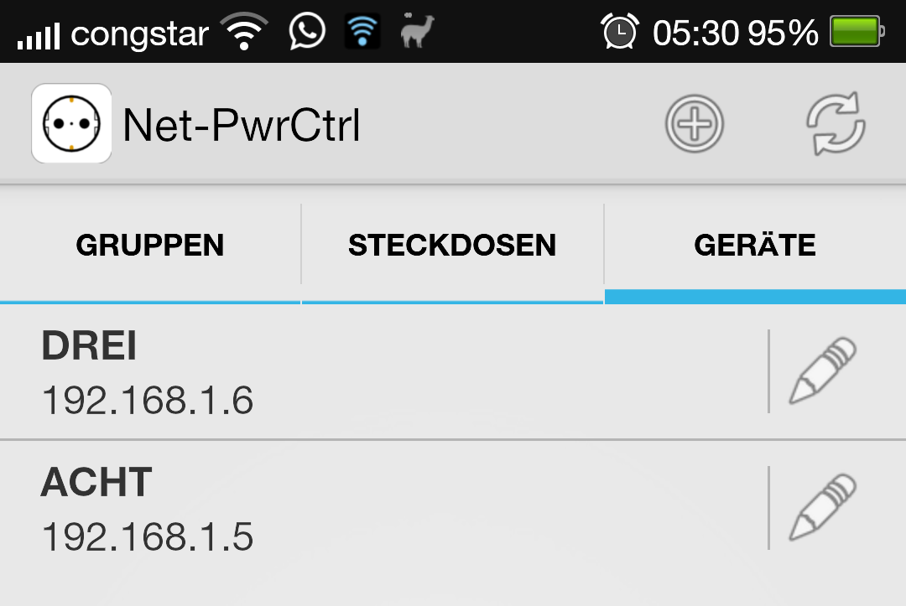
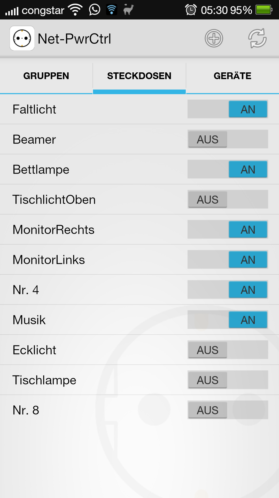

# netpowerctrl
	netpowerctrl is an Android App for controlling ANEL (http://www.anel-elektronik.de)
	switchable network outlets.

You can find a ready to install apk at [Github Releases](https://github.com/davidgraeff/Android-NetPowerctrl/releases)
and on [Google Play](https://play.google.com/store/apps/details?id=oly.netpowerctrl).
For bugs and feature requests please use [Github Issues](https://github.com/davidgraeff/Android-NetPowerctrl/issues).

## Features
* Devices are detected automatically on the network.
* Username/password and individual ports can be configured for every device.
* Create a homescreen widget for a particular outlet and always see the current state of that outlet.
* Use your own icons for on/off/unreachable widget states.
* Overview of all outlets for all configured devices. Reorder and hide outlets.
* Create switch-groups (scenes) to switch multiple outlets at once. Use own icons for scenes.
* Create homescreen shortcuts for scenes.
* Dark and light app theme.
* Tablet layout included to use your screen real estate efficiently.
* Outlets and IO ports of Anel devices are supported.
* Supports plugins to use functionality of other (related) apps.

<table><tr valign="top"><td>

</td><td>

</td></tr></table>

### Automatic device detection
Devices are detected automatically if they are configured for UDP communication.
Default send port 1077 / receive port 1075 (can be configured). Please be aware
that you cannot use port numbers < 1024!

### Support for automation apps like Tasker/Llama
Most of the automation apps support shortcuts of other applications.
Because a shortcut of this app refers to a scene, you may easily switch multiple
outlets as an action within an automation app.

Cool examples:
* This way you can for instance switch on lights if your mobile gets in range of your wifi network.
* You may turn on your amplifier or radio and some lights in the morning.

### Building
To compile, you need the [Android SDK](http://developer.android.com/sdk)
and [Android Studio](http://developer.android.com/sdk/installing/studio.html).
This project is not for the (old) eclipse based SDK! It depends on the
support libraries (v13) and need at least android 4.0 (sdk version 14, released 19. Oct 2011).

### Authors
* david.graeff(at)web_de

### License
Dual licensed: GPLv2+GPLv3
