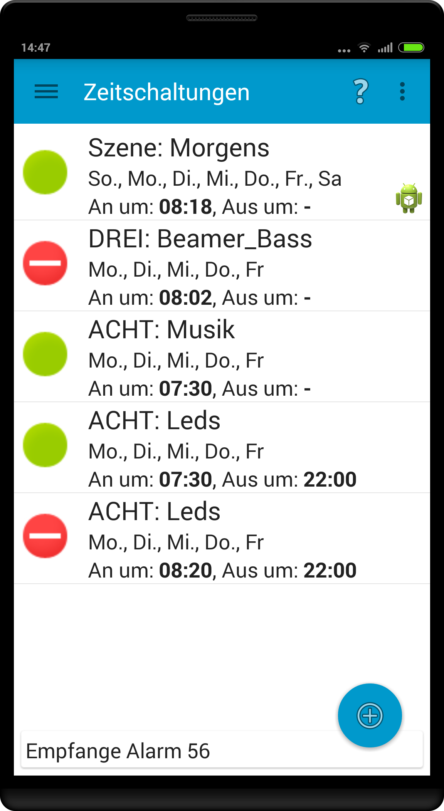

# Smart Power Control
	Smart Power Control is an Android App for controlling switchable outlets
	like the ANEL NET-series (http://www.anel-elektronik.de)

You can find a ready to install apk at [Github Releases](https://github.com/davidgraeff/Android-NetPowerctrl/releases)
and on [Google Play](https://play.google.com/store/apps/details?id=oly.netpowerctrl).
For bugs and feature requests please use [Github Issues](https://github.com/davidgraeff/Android-NetPowerctrl/issues).

## Features
* Devices are detected automatically on the network.
* Username/password and individual ports can be configured for every device.
* Use your own icons for on/off/unreachable widget states.
* Combine multiple switch actions into a "scene". Master/Slave configurations are supported. Use own icons for scenes.
* Create a homescreen widget for a particular outlet or scene and always see the current state of that outlet or master/slave scene.
* Overview of all outlets for all configured devices. Assign actions to specific view groups (for example "bedroom", "living room") and switch easily with a swipe between view groups.
* Create homescreen shortcuts for scenes. Shortcuts can be used by other applications (automation apps) to control your outlets.
* Dark and light app theme.
* Tablet layout included to use your screen real estate efficiently.
* Outlets and IO ports of Anel devices are supported.
* Plugin support. With plugins you can control additional related functionality (at the moment: WakeOnLan for PCs, Yamaha network Amplifiers, Sanyo projectors) with this one app.

<table><tr valign="top">
<td></td>
<td></td>
<td></td>
<td></td>
<td></td>
<td></td>
</tr></table>

### Automatic device detection
Devices are detected automatically if they are configured for UDP communication.
Default send port 1077 / receive port 1075. Please be aware that you cannot use port numbers < 1024 as receive ports because of security restrictions!

### Support for automation apps like Tasker/Llama
Most of the automation apps support shortcuts of other applications.
Because a shortcut of this app refers to a scene, you may easily switch multiple
outlets as an action within an automation app.

Cool examples:
* This way you can for instance switch on lights if your mobile gets in range of your wifi network.
* You may turn on your amplifier or radio and some lights in the morning.

### Building
To compile, you need the [Android SDK](http://developer.android.com/sdk)
and [Android Studio](http://developer.android.com/sdk/installing/studio.html).
This project is not for the old eclipse based SDK! It depends on the
support libraries (v13), additional support library extensions (v7.RecyclerView) and need at least android 4.0 (sdk version 14, released 19. Oct 2011). Parts of the app (import/export/backgrounds) are only usuable with Android 4.4 (DocumentProvider class).

This repository uses git submodules. Use git clone -r to recursivly checkout.

### Plugin Development
All you need to develop a plugin is described in detail at the [Plugin Developer Documentation](https://github.com/davidgraeff/Android-NetPowerctrl-Shared#plugin-developer-documentation).

### Authors
* david.graeff(at)web_de
* Some icons from http://www.clker.com/

### License
Dual licensed: GPLv2+GPLv3
