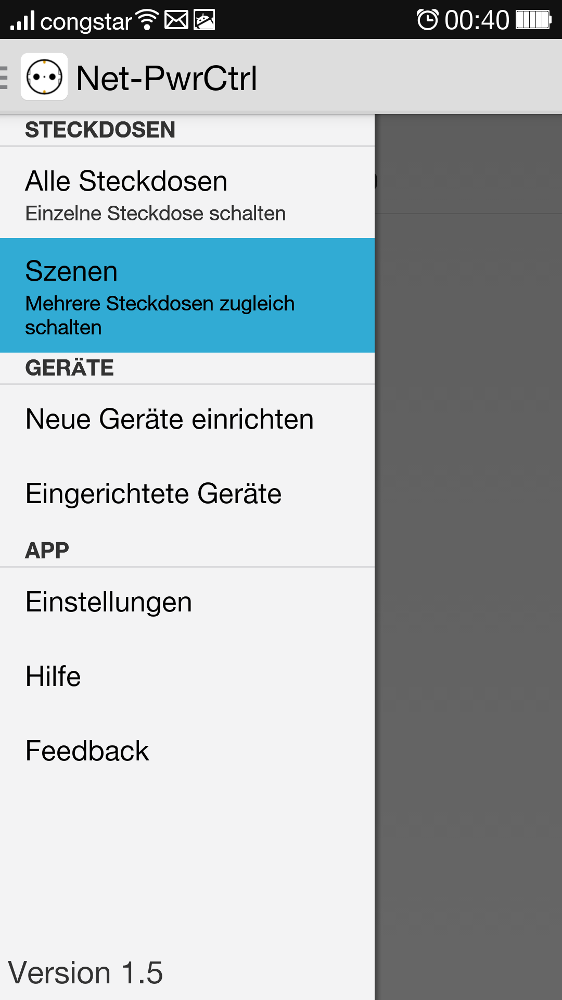

# netpowerctrl
	netpowerctrl is an Android App for controlling ANEL NET-PwrCtrl's (http://www.anel-elektronik.de)
	switchable network outlets.

You can find a ready to install apk at [github Releases](https://github.com/davidgraeff/netpowerctrl-sf-mirror/releases).
For bugs and feature requests please use [github Issues](https://github.com/davidgraeff/netpowerctrl-sf-mirror/issues).

This is an (extended) github mirror of http://sourceforge.net/projects/netpowerctrl/.

## Features
* Devices are detected automatically on the network if they are configured for UDP communication.
  Default send port 1077 / receive port 1075 (can be configured). Please be aware
  that you cannot use port numbers < 1000 because of android restrictions!
* Use discovered devices or create static ones. Set the username/password and
  individual ports for every configured device or use the default ones.
* Create a homescreen widget for a particular (previously configured) device.

Features, you can find on this repository only:
* Overview of all outlets for all configured devices.
* Create switch-groups to switch multiple outlets at once.
* Use Shortcuts for toggling/switching on/off of individual outlets
  on your homescreen (or via automation apps like Tasker/Llama).

## Building
To compile, you need the [Android SDK](http://developer.android.com/sdk).

## License
GPLv2

## Authors
* oly(at)nittka_com
* david.graeff(at)web_de (github mirror maintainer)
