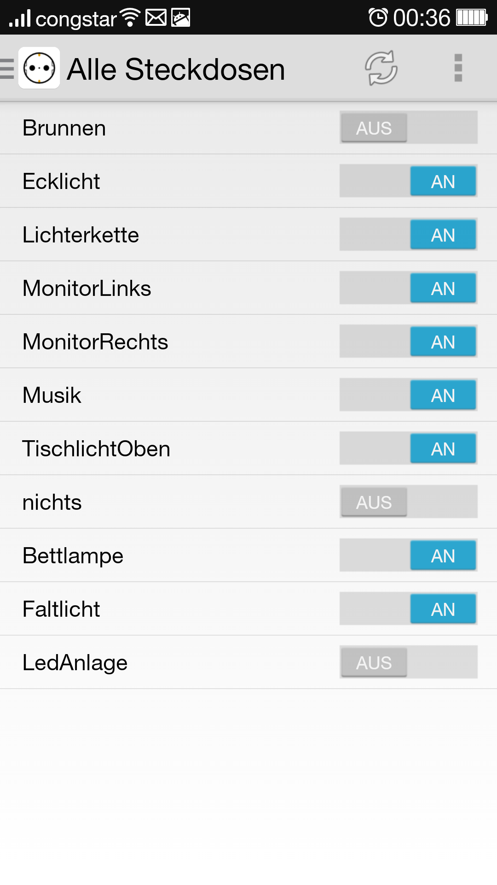

# netpowerctrl
	netpowerctrl is an Android App for controlling ANEL NET-PwrCtrl's (http://www.anel-elektronik.de)
	switchable network outlets.

You can find a ready to install apk at [Github Releases](https://github.com/davidgraeff/Android-NetPowerctrl/releases)
and on [Google Play](https://play.google.com/store/apps/details?id=oly.netpowerctrl).
For bugs and feature requests please use [Github Issues](https://github.com/davidgraeff/Android-NetPowerctrl/issues).

This is an (extended) github mirror of http://sourceforge.net/projects/netpowerctrl/.

## Features
* Devices are detected automatically on the network.
* Username/password and individual ports can be configured for every device.
* Create a homescreen widget for a particular (previously configured) device.
* Overview of all outlets for all configured devices. ²
* Create switch-groups to switch multiple outlets at once. ²
* Use Shortcuts for toggling, switching on/off individual outlets. ²

²: Features, you can find on this repository only

<table><tr valign="top"><td>

</td><td>

</td></tr></table>

### Automatic device detection
Devices are detected automatically if they are configured for UDP communication.
Default send port 1077 / receive port 1075 (can be configured). Please be aware
that you cannot use port numbers < 1024 because of android restrictions!

### Support for automation apps like Tasker/Llama
Most of the automation apps support creating shortcuts for invoking other applications.
You may create shortcuts for single outlets to toggle the state or switch it on/off.
This way you can for instance switch on lights if your mobile gets in range of your wifi network.

### Building
To compile, you need the [Android SDK](http://developer.android.com/sdk).

### Authors
* oly(at)nittka_com
* david.graeff(at)web_de (github mirror maintainer)

### License
GPLv2
